# Guia de Configuração - Integração Clerk com Neon Database

## 📋 Visão Geral

Este projeto está configurado para usar **Clerk** para autenticação e sincronizar usuários com o banco de dados **Neon PostgreSQL**. A lógica implementada garante que:

- ✅ Apenas **1 admin por organização**
- ✅ Novos usuários via signup tornam-se **admin** se a organização não tiver nenhum
- ✅ Usuários subsequentes tornam-se **user** (role padrão)
- ✅ Suporte para login via **Email/Password**, **GitHub** e **Google**

---

## 🚀 Passos de Configuração

### 1. Configurar Webhook no Clerk Dashboard

1. Acesse [Clerk Dashboard](https://dashboard.clerk.com)
2. Vá para **Webhooks** no menu lateral
3. Clique em **Add Endpoint**
4. Configure:
    - **Endpoint URL**: `https://seu-dominio.com/api/webhooks/clerk`
    - **Events to listen**: Selecione:
        - ✅ `user.created`
        - ✅ `user.updated`
        - ✅ `user.deleted`
5. Copie o **Signing Secret** (começa com `whsec_...`)
6. Cole no `.env.local`:

```bash
CLERK_WEBHOOK_SECRET=whsec_seu_secret_aqui
```

---

### 2. Adicionar coluna `clerk_user_id` na tabela `users`

Execute este SQL no seu banco Neon:

```sql
-- Adicionar coluna clerk_user_id se não existir
ALTER TABLE users
ADD COLUMN IF NOT EXISTS clerk_user_id VARCHAR(255) UNIQUE;

-- Criar índice para melhor performance
CREATE INDEX IF NOT EXISTS idx_users_clerk_id ON users(clerk_user_id);
```

---

### 3. Sincronizar Usuários Existentes (Primeira Vez)

Para sincronizar seus usuários existentes do Neon com o Clerk:

#### Opção A: Via API Local (Desenvolvimento)

```bash
# Execute o servidor
npm run dev

# Em outro terminal, faça a requisição
curl -X GET http://localhost:3000/api/sync-users \
  -H "Authorization: Bearer seu-token-aqui"
```

#### Opção B: Sincronização Manual

Para cada usuário existente:

1. Faça login no Clerk com o email do usuário
2. O webhook irá automaticamente associar o `clerk_user_id`

---

### 4. Testar a Integração

#### A. Teste de Signup (Novo Admin)

1. Acesse `/signup` ou clique em **Sign Up** na página de login
2. Cadastre-se com:
    - Email/senha OU
    - Conta GitHub OU
    - Conta Google
3. **Resultado esperado**:
    - ✅ Usuário criado no Clerk
    - ✅ Usuário criado no Neon com `role = 'admin'` (primeiro da organização)
    - ✅ `clerk_user_id` preenchido

#### B. Teste de Signup (Novo User)

1. Faça logout
2. Cadastre outro usuário
3. **Resultado esperado**:
    - ✅ Usuário criado no Clerk
    - ✅ Usuário criado no Neon com `role = 'user'` (já existe admin)

#### C. Teste de Permissões

1. Faça login como **admin**:
    - ✅ Deve ver botões "Adicionar", "Editar", "Deletar"
2. Faça login como **user**:
    - ❌ Não deve ver botões de ação (apenas visualização)

---

## 🔧 Estrutura dos Arquivos Criados

```
app/
├── api/
│   ├── webhooks/
│   │   └── clerk/
│   │       └── route.ts          # Webhook handler do Clerk
│   └── sync-users/
│       └── route.ts               # API para sincronizar usuários
├── lib/
│   └── auth-helpers.ts            # Funções auxiliares de autenticação
```

---

## 📊 Fluxo de Autenticação

```mermaid
graph TD
    A[Usuário faz Sign Up] --> B{Clerk cria usuário}
    B --> C[Webhook dispara]
    C --> D{Usuário existe no Neon?}
    D -->|Sim| E[Atualiza clerk_user_id]
    D -->|Não| F{Org tem admin?}
    F -->|Não| G[Cria user com role=admin]
    F -->|Sim| H[Cria user com role=user]
    E --> I[Usuário autenticado]
    G --> I
    H --> I
```



---

## 🔐 Funções Auxiliares de Autenticação

### `isUserAdmin()`

Verifica se o usuário atual é admin.

```typescript
import { isUserAdmin } from "@/app/lib/auth-helpers";

// Em componente server
export async function MyComponent() {
  const isAdmin = await isUserAdmin();

  if (!isAdmin) {
    return <div>Acesso negado</div>;
  }

  return <div>Conteúdo admin</div>;
}
```

### `getCurrentUser()`

Obtém dados do usuário atual do banco.

```typescript
import { getCurrentUser } from "@/app/lib/auth-helpers";

export async function Profile() {
  const user = await getCurrentUser();

  return (
    <div>
      <h1>{user?.name}</h1>
      <p>{user?.email}</p>
      <p>Role: {user?.role}</p>
    </div>
  );
}
```

### `getCurrentUserOrgId()`

Retorna o ID da organização do usuário.

```typescript
import { getCurrentUserOrgId } from "@/app/lib/auth-helpers";

export async function fetchData() {
    const orgId = await getCurrentUserOrgId();
    // Usar para filtrar dados por organização
}
```

---

## ⚠️ Observações Importantes

### Multi-Organização (Futuro)

Atualmente, o sistema usa uma organização padrão (`00000000-0000-0000-0000-000000000000`). Para suportar múltiplas organizações:

1. Modifique o webhook para criar/associar organizações dinamicamente
2. Adicione seletor de organização no signup
3. Implemente lógica de convites

### Segurança

- ✅ Webhook verificado com Svix signatures
- ✅ Permissões verificadas no servidor (não apenas UI)
- ✅ Queries usam parametrização para prevenir SQL injection

### Performance

- ✅ Índice criado em `clerk_user_id` para queries rápidas
- ✅ Cache pode ser adicionado nas funções de auth-helpers se necessário

---

## 🐛 Troubleshooting

### Webhook não está funcionando

1. Verifique se `CLERK_WEBHOOK_SECRET` está correto no `.env.local`
2. Em desenvolvimento, use **ngrok** ou **localtunnel** para expor localhost
3. Verifique logs em Clerk Dashboard -> Webhooks -> Attempts

### Usuário não sincronizado

1. Verifique se o webhook recebeu o evento (`user.created`)
2. Execute manualmente: `GET /api/sync-users`
3. Verifique logs do console

### Permissões não funcionando

1. Confirme que `clerk_user_id` está preenchido no banco
2. Verifique se a função `isUserAdmin()` está sendo chamada
3. Limpe cache do Next.js: `rm -rf .next`

---

## 📝 Próximos Passos Sugeridos

1. [ ] Adicionar testes automatizados para webhook
2. [ ] Implementar soft delete ao invés de hard delete
3. [ ] Adicionar logs de auditoria
4. [ ] Implementar sistema de convites para organização
5. [ ] Adicionar suporte para múltiplas organizações por usuário
6. [ ] Implementar rate limiting no webhook
7. [ ] Adicionar dashboard de analytics de autenticação

---

## 📞 Suporte

Para dúvidas ou problemas:

- [Documentação Clerk](https://clerk.com/docs)
- [Documentação Neon](https://neon.tech/docs)
- Logs do servidor: verifique console do terminal
